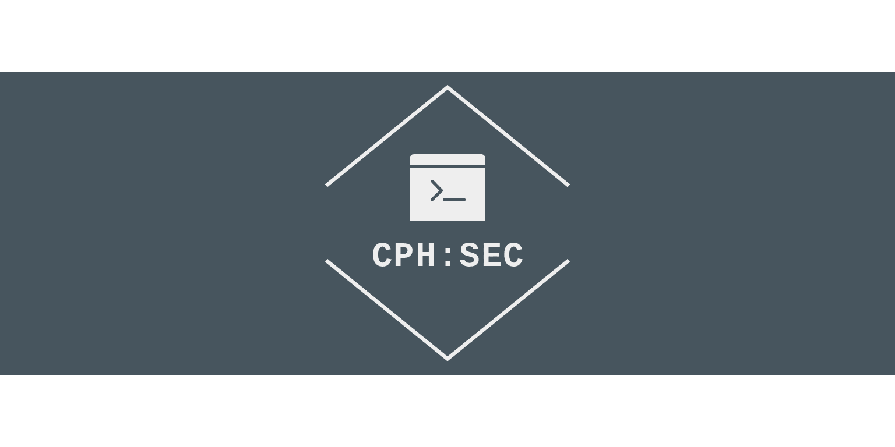

# CPH:SEC
## Copenhagen Ethical Hacking and Penetration Testing Society

### Index
[CPH:SEC - A Scriptkiddies Guide to Web Hacking Using Automatic Tools:](scriptkiddie.md)
 <a href="https://CPH-SEC.github.io/pentestinfra.md">Visit W3Schools.com!</a> 
[CPH:SEC - How to Build a Covert Pentesting Infrastructure Almost Free - Part 1:](https://CPH-SEC.github.io/pentestinfra.md)
[CPH:SEC - Using Metasploit Framework the Right Way - With Scripts:](https://CPH-SEC.github.io/metasloit_scripting.md)

[CPH:SEC - How to Write for CPH:SEC:](https://CPH-SEC.github.io/cphsec_howtowrite.md)
[CPH:SEC - Template:](https://CPH-SEC.github.io/cphsec_template.md)

[Hackers Resources Galore:](https://github.com/Shiva108/CTF-notes)
[CPH:SEC WAES: Web Auto Enum & Scanner - Auto enums website(s):](https://github.com/Shiva108/WAES)
[Escalation Servers and Scripts for Priv Escalation:](https://github.com/Shiva108/escalationserver)
