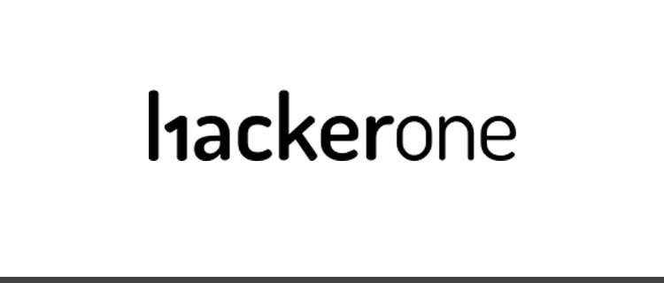
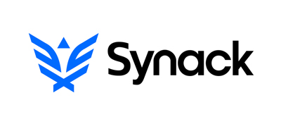

## CPH:SEC - A beginner's guide to bug bounties
##### v. 0.2 A

_Disclaimer & Caveat Lector: This article is for educational purposes only. The author is not responsible for any misuse or wrong doing. Always follow the law, white-hat hacking ethics and good business practice as well as industry standards._

+ By Martin Thirup @ CPH:SEC: http://hackerone.com/mthirup

### **Table of Contents**

1. #### [Introduction](#Introduction)
2. #### [List of bug bounty platforms and programs](The-list)
3. #### [How to get started](#How)
4. #### [TopicN](#TopicN)[?]
5. #### [TopicN](#TopicN)[?]
6. #### [Conclusion](#Conclusion)

### Introduction

This article is for people, who are looking for legal ways to use their pentesting skills to challenge themselves. There are multiple opportunities, depending on what you find exciting and your primary areas. This chapter will focus on web-hacking due to the fact that it is the most common scope at bug bounty programs. However, there are bug bounty programs for network hacking, mobile app hacking, IoT hacking and more.

### List of Bug Bounty Platforms and Programs

First of all, it's important to keep track on all the bug bounty programs. Most of the programs are typically located at platforms like hackerone, bugcrowd, synack, cobalt, intigrity or others. However, some companies like Microsoft, AT&T, Apple, google, facebook and others prefer to run their programs without these platforms. The best way to find these is by using google or looking for public lists like Firebounty https://firebounty.com/

Here's a short summary over the different bug bounty platforms.

#### Hackerone

[hackerone](https://hackerone.com/directory)

Hackerone is the biggest bug bounty platform in the world, which has a huge list of programs to be explored. The positive side of hackerone is that there are plenty of programs to try out, which makes it possible to grind on the platform, if you have the dedication for it. However, you are competing against 200.000+ other hackers in identifying the vulnerabilities first, and most programs start out as invite-only for some few people. As soon as you get your first points going, you will get invited to participate in programs before other people, but you will have a disadvantage, when you start. As soon as you have made some submissions, remember to mark your specialist skills set under your profile, as shown in the picture below. You need to have 3 submissions, that are worth showing off within a topic to have your primary skill approved by the hackerone staff, but do it as soon as you can to get invited to programs, that are more suitable for you.

[image](insert billede her.jpg) _[?] Billede mangler_

#### Synack

[Synack](https://hackerone.com/directory)

Synack is a closed platform, where you need to be approved for your skills, experience etc. to test for them. _[?] Har du ikke mere at sige om synack? For og imod de andre_

#### Bugcrowd, Cobalt and Intigrity:

Bugcrowd¹, Cobalt² and Intigrity³ are platforms that are very identical to hackerone, but just smaller. Bugcrowd, cobalt and intigrity also have public and invite-only programs, while some reward you in payments, others give kudos/hall of fame.

#### Surf:
+ ¹Bugcrowd: https://www.bugcrowd.com/
+ ²Cobalt: https://cobalt.io/
+ ³Intigrity: https://www.intigriti.com/public/

### How to get started

My personal advice: Start out with programs that give points, but don't pay cash in the beginning, just to get started and get some findings, since you may get invited to private programs sooner this way. ALWAYS read the rules of the programs through before you start testing. Some programs have an open scope for all the domains and subdomains, while others only cover a small scope of subdomains. There might also be rules about automated testing and other stuff that's worth noting.

### Recon

Always start out with some good reconnaissance before you start hacking. There are people all around the world, who want to identify vulnerabilities just like you, so always try to find the weak link, where others aren't looking. If a domain has an open scope, where and subdomain is eligible, get sublist3r¹ started to identify subdomains. Also, it's a good idea to get familiar with google dorking to find subdomains, that look interesting. Google dorking is a bigger subject for itself, but learn how to use the search operators depending on what you are looking for. But as an example, if a vulnerability had just been discovered in Apache struts, it would be obvious to search for site:example.com ext:action. Nmap scripting is also a good way to identify interesting information or vulnerabilities. If you are looking for interesting directories or specific CMS systems, http-enum is recommended, as it would show you which domains had a directory called /wordpress/ or /blog/ or domains containing /wp-admin.php. Drupal can be identified, if it has a file containing /CHANGELOG.txt in caps and so on. If you're lucky, you might even find an sql dump or other sensitive information thanks to http-enum. All in all, your recon depends on, what you're looking for

#### Surf:
+ ¹https://github.com/aboul3la/Sublist3r

### Reconnaissance through Burp Suite

Burp suite is the most important tool for web hackers. The proxy allows you to intercept the traffic you make through the domains in the scope and manipulate the data in an easier way to identify vulnerabilities. Getting started with burp suite is an important chapter for itself, which is best to read about on portswigger's website¹. My first step is always to load the list of subdomains identified through Sublist3r. Save the list and go to target -> scope and use load to enter all the subdomains. Load all the urls through urlopener.net, and you will soon see that all the active hosts will show up in the Site Map tab with some few discoveries for the some of the hosts. At this point, it's all about crawling the hosts to have a good overview over the systems. You can sort through parameterized requests or MIME(HTML,SWF,XML etc). By clicking the filter tab above the hosts, you can filter out all the results in the same way. I always try defining the scope to only show file extensions as asp,aspx,jsp,php,do,action,cfm,cgi,dll,swf,fcc,pl. Try removing some of them to find uncommon file types depending on how your results look.

### Conclusion

I will not go into the steps of identifying vulnerabilities in this tutorial due to the large amount of coverage it would take. OWASP¹ has a lot of useful articles, together with the repository called payloadsallthethings¹². Otherwise, google is always your friend. Hacking is about learning and finding your own preferred patterns of identifying vulnerabilities, so keep hacking to learn.

#### Surf:
+ ¹https://portswigger.net/burp/documentation/desktop/getting-started
+ ²https://www.owasp.org/index.php/Main_Page
+ ³http://pentester.land

#### Additional Bug Bounty references:
+ Bug Bounty Reference: https://github.com/ngalongc/bug-bounty-reference
+ Awesome Bug Bounty: https://github.com/djadmin/awesome-bug-bounty
