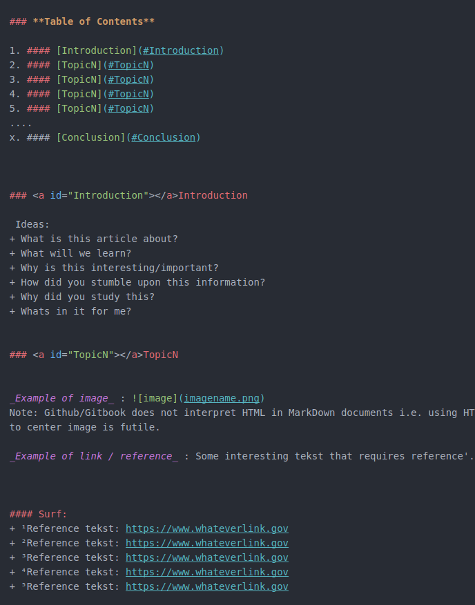
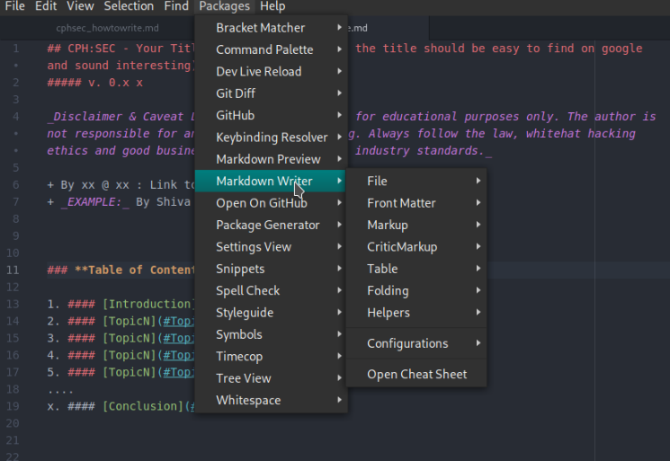

## CPH:SEC - How to Write for CPH:SEC
#### v. 0.1  a

_Disclaimer & Caveat Lector: This article is for educational purposes only. The author is not responsible for any misuse or wrong doing. Always follow the law, whitehat hacking ethics, good business practice and industry standards._

+ By Shiva @ CPH:SEC : https://cph-sec.github.io/


### **Table of Contents**

1. #### [Introduction](#Introduction)
2. #### [The Markdown Template](#Template)
3. #### [Using Atom](#Atom)
4. #### [Entering An Article, Write-Up or Whitepaper](#Entering)
5. #### [Conclusion](#Conclusion)


### <a id="Introduction"></a>Introduction

Its the dream to put Copenhagen and Danish white-hat hackers on the world map by creating solid content i.e. hacking guides for the CPH:SEC GitBook.
This way both writers and readers can enjoy CPH:SEC hacking guides. High quality guides are in popular demand and so an initiative of corporation is needed.
This is the dream of the CPH:SEC GitBook project or put simply: **We all like more hacking guides right?**
Using GitBook for hosting is a free, efficient and somewhat low-tech way to deliver content to readers and is easy to use for a linux user, hacker, programmer and works on all platforms.
Like Github, GitBook supports MarkDown (MD) natively and so to make writing easy there is a CPH:SEC MD template.

This article describes how to use the CPH:SEC .md template and use Atom for doing so. Using Atom is a suggestion, not a requirement.
Furthermore the process for entering your work is described in chapter 4.


### <a id="Template"></a>The Markdown Template

MarkDown is to documents what HTML is for web pages i.e. a markup language or as wikipedia desribes it:

> "Markdown is a lightweight markup language with plain text formatting syntax. It is designed so that it can be converted to HTML and many other formats using a tool by the same name.[8] Markdown is often used to format readme files, for writing messages in online discussion forums, and to create rich text using a plain text editor. As the initial description of Markdown contained ambiguities and unanswered questions, many implementations and extensions of Markdown appeared over the years to answer these issues."
> Wikipedia¹

Meaning its a document writer "language". The idea is that the writer do not need to all the hazzle with big applications like MS Word or similar.

The document is always available in the new version here: https://github.com/CPH-SEC/CPH-SEC.github.io/blob/master/cphsec_template.md

Using linux the template can be easely downloaded using wget:

```
wget https://github.com/CPH-SEC/CPH-SEC.github.io/blob/master/cphsec_template.md
```

The template is simple and gives basic structure, easy for readers to recognize, and gives hints for usage.



For editing MD documents most editors can be used. However, in next it is described how to use Atom for editing.


### <a id="Atom"></a>Using Atom

While any plain text editor (opposite to WHYSIWYG editors like MS-Word) can be used for editing .MD documents Atom seems to be a good balance between performance and functionality. Vim fans, can skip this section.

Atoms has two possible addons that comes in handy when working with .MD documents i.e. "MarkDown Preview" and "MarkDown Writer", refer to the below screenshot.



While "MarkDown Writer" is somewhat for the beginners "MarkDown Preview" makes it possible to preview a "rendered" version of the document. This is achieved by pressing CTRL+SHIFT+M and the preview with appear on right.

Remember to save as .md with a new name.


#### Surf:
+ ¹Wikipedia, Markdown: https://en.wikipedia.org/wiki/Markdown

### <a id="Entering"></a>Entering An Article, Write-Up or Whitepaper

When the first draft is done, zip it (including pictures) and send it to: cph-sec@gmail.com
After review it will be uploaded Github and a notifcation will be sent.
Assuming that there are no changes the article will be revealed at a good "SEO time", most likely in the afternoon, not in weekends.


### <a id="Conclusion"></a>Conclusion

_Ideas_
+ What did we learn?
+ Whats up next?
+ Thanks to xx
