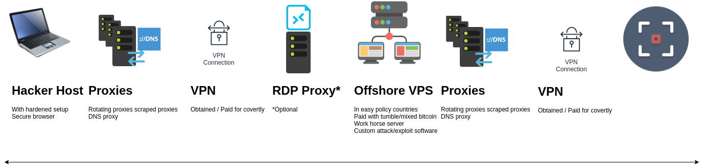

## CPH:SEC - How to Build a Covert Pentesting Infrastructure Almost Free - Part 1
### a.k.a. Making a Cyberweapon with Stealth
##### v. 0.1 beta

_Disclaimer & Caveat Lector: This article is for educational purposes only. The author is not responsible for any misuse or wrong doing. Always follow the law, whitehat hacking ethics, good business practice as well as industry standards._

+ By Shiva @ CPH:SEC : https://cph-sec.github.io/
+ Quality Control by xxx @ xxxx

### **Table of Contents**

1. #### [Introduction](#Introduction)
2. #### [Attacker Localhost Setup](#localhost)
  1. #### [Check List](#checklist)
  2. #### [Scraping ](#scraping)
  3. #### [Redsocks Install & Setup](#redsocks)
  4. #### [Secure DNS](#securedns)
  5. #### [Redsocks with Multiple Proxies](#multiple)
  6. #### [Virtual Private Network](#vpn)
3. #### [Conclusion](#Conclusion)

### <a id="Introduction"></a>Introduction

This is the first part of a series on how to build a covert pentesting infrastructure. Part 1 will focus on setting up the attackers localhost, that will then be able to connect to the attack VPS cloud server covertly using a mix of socks5 -, DNS -proxies and VPN.
The knowledge in these articles comes in handy for red teaming or engangements that require anonymity. As a reader you will learn state of the art modern method thats is not costly to build a pentesting infrastructure. The article series is as suchs:

+ Part 1: Attacker Localhost Setup (This article)
+ Part 2: Workhorse VPS /Cloud Installation and Setup
+ Part 3: Custom Attack / Explotation Software

See the below illustration to get an overview of this project. Part 1 covers "Hacker Host", Proxies and VPN.




The last chapter "Surf" includes a large reference of links, should the reader be interested.


### <a id="localhost"></a>Attacker Localhost Setup

The attackers localhost is the machine that must never be compromised or traced as it will reveal the identity of the operating agent. One could argue that part 1 is therefore the most important of the 3 parts.

#### <a id="checklist"></a>Check List

A short primer checklist before the actual deepdive into tech anonymity:

- Connect to (multiple) scraped anon socks5 proxy and secured DNS proxy
- Connect to a logless VPN that was obtained covertly
- Connect to the internet through Tor or other browser that does not allow fingerprinting
- DNS settings are configured to use a logless DNS
- Logged out of all online accounts
- Closed all apps and background services connected to the web
- All tracking in my browser and OS are turned off and blocked
- Emails are sent using burner accounts
- New accounts registered and logged in with burner emails
- Search with DuckDuckGo or StartPage
- Bitcoins are properly mixed and using a third-party wallet
- Use foreign hardware, if at all possible. Preferly other than your neighbours wifi.


#### <a id="scraping"></a>Scraping Proxies

In order to setup a proxy server (see Redsocks chapter) with random proxies first some must be fetched. This is done by using the tool "fetch-some-proxies"¹. Simply run ./fetch.sh to fetch proxies which will execute the following commands:

```
sudo python fetch-some-proxies/fetch.py | tee proxyscrape.tmp
sudo grep -e "elite" proxyscrape.tmp > proxyscrape2.tmp
sudo grep -e "socks5" proxyscrape2.tmp > proxyscrape.lst
rm proxyscrape*.tmp
cat proxyscrape.lst
```
Only socks5 proxies of the elite type is of interest as several protocols must be routed to the proxy and with as high an anonymity as possible.


As unwanted proxies are now filtered away a proxy with short latency is chosen from "proxyscrape.lst", e.g. socks5://178.62.59.71:4076 . Now that the proxy list is populated the next chapter will show how to use a scraped proxy with redsocks.

#### <a id="redsocks"></a>Redsocks Install & Setup

"Redsocks is the tool that allows you to proxify(redirect) network traffic through a SOCKS4, SOCKS5 or HTTPs proxy server. It works on the lowest level, the kernel level (iptables). The other possible way is to use application level proxy, when the proxy client is implemented in the same language as an application is written in. Redsocks operates on the lowest system level, that’s why all running application don’t even have an idea that network traffic is sent through a proxy server, as a result it is called a transparent proxy redirector." ¹⁴


```
sudo apt-get install redsocks
sudo nano /etc/redsocks.conf
```
Then insert redsocks.conf file included (see below) and continue:
```
sudo redsocks -c /etc/redsocks.conf
```

redsocks.conf :
```
base {
 log_debug = on;
 log_info = on;
 log = "stderr";
 daemon = off;
 redirector = iptables;
}

redsocks {
    local_ip = 127.0.0.1;
    local_port = 12345;

		// socks5://178.62.59.71:4076
    ip = 178.62.59.71;
    port = 4076;
    type = socks5;
      // known types: socks4, socks5, http-connect, http-relay

    // login = username;
    // password = password;
}

dnstc {
	// fake and really dumb DNS server that returns "truncated answer" to
	// every query via UDP, RFC-compliant resolver should repeat same query
	// via TCP in this case.
	local_ip = 127.0.0.1;
	local_port = 5300;
}

// you can add more `redsocks' and `redudp' sections if you need.

```

This concludes the installation and setup of redsocks. However, to route all traffic trough redsocks and the scraped proxy IPtables are required. For installing IPtables and setting up with redsocks refer to "debian manpages"¹⁶ and stackexchange¹⁵. In any case, using the script included with this project both redsocks and IPtables can be started using ./startREDsocks.sh:

```
#!/usr/bin/env bash
sudo ./restartDNScrypt.sh
sudo ./iproute.sh
echo "Starting redsocks, run IProute after to route traffic"
sudo redsocks -c /etc/redsocks.conf
sudo ./resetiproute.sh
sudo ./myip.sh
```

While DNScrypt and secure DNS in general will be covered in the next chapter "Secure DNS", ./iproute.sh routes traffic through redsocks proxy with iptables and ./resetiproute.sh stops the routing through redsocks. A closer look:

```
#!/usr/bin/env bash
echo "Routing selected ports trough redsocks proxy"
echo " "

sudo iptables -t nat -N REDSOCKS
sudo iptables -t nat -A REDSOCKS -d 0.0.0.0/8 -j RETURN
sudo iptables -t nat -A REDSOCKS -d 10.0.0.0/8 -j RETURN
sudo iptables -t nat -A REDSOCKS -d 127.0.0.0/8 -j RETURN
sudo iptables -t nat -A REDSOCKS -d 169.254.0.0/16 -j RETURN
sudo iptables -t nat -A REDSOCKS -d 172.16.0.0/12 -j RETURN
sudo iptables -t nat -A REDSOCKS -d 192.168.0.0/16 -j RETURN
sudo iptables -t nat -A REDSOCKS -d 224.0.0.0/4 -j RETURN
sudo iptables -t nat -A REDSOCKS -d 240.0.0.0/4 -j RETURN

sudo iptables -t nat -A REDSOCKS -p tcp -j REDIRECT --to-ports 12345

sudo iptables -t nat -A OUTPUT -p tcp --dport 443 -j REDSOCKS
sudo iptables -t nat -A OUTPUT -p tcp --dport 80 -j REDSOCKS
sudo iptables -t nat -A OUTPUT -p tcp --dport 22 -j REDSOCKS
sudo iptables -t nat -A OUTPUT -p tcp --dport 21 -j REDSOCKS

sudo iptables -t nat -A PREROUTING -p tcp --dport 443 -j REDSOCKS
sudo iptables -t nat -A PREROUTING -p tcp --dport 80 -j REDSOCKS
sudo iptables -t nat -A PREROUTING -p tcp --dport 21 -j REDSOCKS
sudo iptables -t nat -A PREROUTING -p tcp --dport 22 -j REDSOCKS
```

Note that depending on what ports should be forwarded it might be necessary add or change dport lines. As for resetiproute.sh it works like so:

```
#!/usr/bin/env bash
echo "Resetting IPtables i.e. stop routing trough redsocks proxy"
echo " "
sudo iptables -F
sudo iptables -X
sudo iptables -Z
sudo iptables -t nat -F
sudo iptables -t nat -X
sudo iptables -t nat -Z
killall redsocks
```
For more information on IPtables please refer to "How to force all Linux apps to use SOCKS proxy" ¹².

#### <a id="multiple"></a>Redsocks with Multiple Proxies

Adding additional proxies to redsocks doesnt necessarily lead to higher anonymity or security, as the proxies are not chained and still DNS leak, but will help balacing the load. As before "/etc/redsocks.conf" file must be edited, this time with additional chapters, like so:

```
**More proxies**
redsocks {
    local_ip = 127.0.0.1; ip = 127.0.0.1; type = socks5;
    local_port = 11080;
    port = 1080;
}
redsocks {
    local_ip = 127.0.0.1; ip = 127.0.0.1; type = socks5;
    local_port = 11081;
    port = 1081;
}
redsocks {
    local_ip = 127.0.0.1; ip = 127.0.0.1; type = socks5;
    local_port = 11082;
    port = 1082;
}
```
Furthermore, "iproute.sh" needs to be updated accordingly:
```
iptables … -m random --mode random --probability 0.3333333333 -j REDIRECT --to-ports 11080
iptables … -m random --mode random --probability 0.3333333333 -j REDIRECT --to-ports 11081
iptables … -j REDIRECT --to-ports 11082
```
Now enjoy seemless proxy rotation.

The purpose of this project is to be covert and despite the use of socks5 proxy there is still DNS leak, although IP is now spoofed. To test different scenarios "dnsleaktest.com" ⁹ is utilized and although origin IP is spoofed, showing IP of the proxy, a "dnsleaktest.com" extended test still show original IP. To avoid this DNS must be covert and so this is covered in the next chapter "Secure DNS".


#### <a id="securedns"></a>Secure DNS

Proxies and IP-spoofing is pointless without a secure DNS as DNS leak will reveal the IP of origin. (Good) VPNs setup there own DNS for same and could VPNs be thrusted solely scraped proxy and secure DNS would not be required. As this is not the case read on.

**DNS over Proxy**

There are several services that delivers DNS over proxy. For more information on DNS via proxy please refer to the surf section "Anon DNS Servers" ²⁴ ²⁵. Setting up DNS proxy is quite straightforwared, in the following example https://dns.watch ²⁴ DNS servers are applied. First update the resolver configuration:

```
sudo nano /etc/resolvconf/resolv.conf.d/base
  nameserver 84.200.69.80
  nameserver 84.200.70.40
sudo resolvconf -u
```

Then set DNS for both IPv4 and IPv6 using the NetworkManager²³:

1. Search ' Network Connection'
2. Open it
> 
3. Then select either WiFi or Ethernet, or whatever you are using, and click on edit. You'll get this:
> 

4 .Select ipv4 in tabs
5. Select addresses only in method
6. Enter your DNS name below, and save it (dont use 8.8.8.8, its Google transparent DNS, but e.g. 84.200.69.80)
7. Repeat 4-6 for IPv6 also for all interfaces
8. Restart NetworkManager "sudo service network-manager restart"
9. Go test on dnsleaktest.com

Testing with "dnsleaktest.com" result will now be as intended:


Next chapter shows how to use DNSCrypt to add an extra level of DNS anonymity.


**DNSCrypt-Proxy Install & Setup**

As DNS leak was fixed by the configuration in the last chapter, some might still want to implemented DNSCrypt as an additional level of protection, although its not strictly needed. First install DNSCrypt proxy like so:

```
sudo apt purge dnscrypt-proxy
sudo apt update
sudo apt install dnscrypt-proxy
sudo systemctl restart NetworkManager
sudo systemctl restart dnscrypt-proxy
sudo apt install resolvconf
sudo nano /etc/NetworkManager/NetworkManager.conf
```

Then edit "NetworkManager.conf" to look like this:

```
[main]
dns=default

plugins=ifupdown,keyfile

[ifupdown]
managed=false

[device]
wifi.scan-rand-mac-address=no
```

And finally run "./restartDNScrypt.sh", which does the following:

```
sudo systemctl stop systemd-resolved
sudo systemctl disable systemd-resolved
sudo systemctl restart network-manager
sudo systemctl restart dnscrypt-proxy
```

In the next chapter another level of anonymity is presented as the use of VPN is discussed.


#### <a id="vpn"></a>Virtual Private Network


##### <a id="bitcoin"></a>Bitcoin Mixing / Tumbling


### <a id="TopicN"></a>TopicN

_Your text here_


### <a id="Conclusion"></a>Conclusion

_Ideas_
+ What did we learn?
+ Whats up next?
+ Thanks to xx


### Surf (LMGTFY):

#### Tools
+ ¹ Fetch-some-proxies: https://github.com/stamparm/fetch-some-proxies
+ ² https://github.com/jorgenkg/python-proxy-rotator
+ ³ https://github.com/allfro/pymiproxyhttps://www.thesaurus.com/browse/necessarily
+ ⁴ https://github.com/constverum/ProxyBroker

#### Multiple TOR Proxies
+ ⁵ http://blog.databigbang.com/running-your-own-anonymous-rotating-proxies/
+ ⁶ http://www.haproxy.org/
+ ⁷ http://blog.databigbang.com/distributed-scraping-with-multiple-tor-circuits/
+ ⁸ http://www.delegate.org/delegate/

#### Test
+ ⁹ DNS leak test: https://www.dnsleaktest.com
+ ¹⁰ Whats my IP: https://www.whatsmyip.org/
+ ¹¹ Browser fingerprinting test: https://panopticlick.eff.org/

#### Redsocks and IPtables
+ ¹² How to force all Linux apps to use SOCKS proxy: https://superuser.com/questions/1401585/how-to-force-all-linux-apps-to-use-socks-proxy?rq=1
+ ¹³ https://crosp.net/blog/administration/install-configure-redsocks-proxy-centos-linux/
+ ¹⁴ https://unix.stackexchange.com/questions/71429/redirect-all-non-local-traffic-to-a-socks-proxy
+ ¹⁵ https://manpages.debian.org/stretch/iptables/iptables-extensions.8.en.html#TPROXY
+ ¹⁶ Escape proxy hell with Redsocks: https://jmkhael.io/escape-proxy-hell-with-redsocks/

#### Anon VPS
+ ¹⁷ Anonymous SSD VPS: https://anonymously.io/anonymous-vps/
+ ¹⁸ Cheap Anonymous VPS Providers: https://cheapvillage.com/cheap-anonymous-vps-providers/
+ ¹⁹ Dreamhost with bitcoin: https://bitlaunch.io/

#### DNS Leak Avoidance
+ ²⁰ https://www.smarthomebeginner.com/vpn-kill-switch-with-ufw/
+ ²¹ https://support.rackspace.com/how-to/changing-dns-settings-on-linux/
+ ²² https://unix.stackexchange.com/questions/128220/how-do-i-set-my-dns-when-resolv-conf-is-being-overwritten/163506#163506
+ ²³ https://unix.stackexchange.com/questions/494324/how-to-setup-dns-manually-on-linux

#### Anon DNS servers
+ ²⁴ Secure DNS root: https://dns.watch
+ ²⁵ Secure DNS root: https://www.opennic.org/

#### RDP
+ ²⁶ RDP Manual: https://5socks.net/Manual/rdp_eng.html
+ ²⁷ RDP VPN Manual: https://5socks.net/Manual/what_is_rdp_vpn_eng.htm

#### SSH Routing
+ ²⁸ https://linuxize.com/post/how-to-setup-ssh-socks-tunnel-for-private-browsing/
+ ²⁹ https://www.dnsflex.com/how-to-route-all-network-traffic-from-your-lan-securely-through-a-socks5-proxy-ssh-tunnel-redsocks/
+ ³⁰ https://hackertarget.com/ssh-examples-tunnels/

#### SSH Routing with a Service
+ ³¹ Expose local servers to the internet: https://serveo.net/
+ ³² Public URLs for exposing your local web server: https://ngrok.com/
