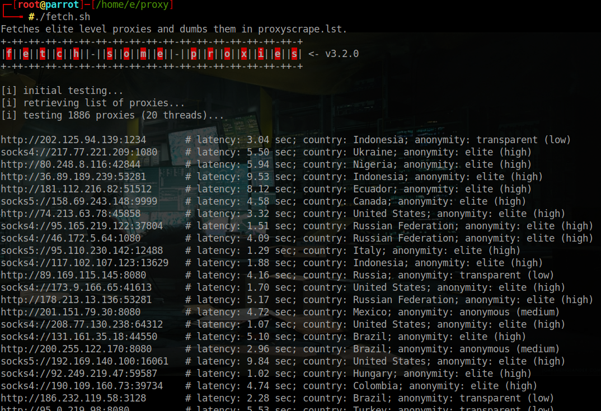
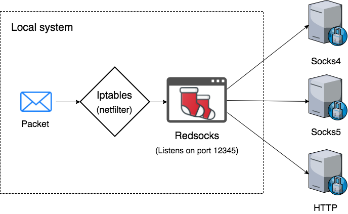

## CPH:SEC - How to Build a Covert Pentesting Infrastructure Almost Free
#### a.k.a. Making a Cyberweapon with Stealth
##### v. 0.1 a

_Disclaimer & Caveat Lector: This article is for educational purposes only. The author is not responsible for any misuse or wrong doing. Always follow the law, whitehat hacking ethics, good business practice as well as industry standards._

+ By Shiva @ CPH:SEC : https://cph-sec.github.io/
+ Quality Control by xxx @ xxxx

### **Table of Contents**

1. #### [Introduction](#Introduction)
2. #### [TopicN](#TopicN)
3. #### [TopicN](#TopicN)
4. #### [TopicN](#TopicN)
5. #### [TopicN](#TopicN)
....
x. #### [Conclusion](#Conclusion)


### <a id="Introduction"></a>Introduction

 Ideas:
+ What is this article about?
+ What will we learn?
+ Why is this interesting/important?
+ How did you stumble upon this information?
+ Why did you study this?
+ Whats in it for me?

### <a id="localhost"></a>Attacker Local Host Setup

some text what whatever

#### <a id="checklist"></a>Check List

- Connected to a logless VPN
- Connected to the internet through Tor or other browser that does not allow fingerprinting
- DNS settings are configured to use a logless DNS
- Logged out of all online accounts
- Closed all apps and background services connected to the web
- All tracking in my browser and OS are turned off and blocked
- Emails are sent using burner accounts
- New accounts registered and logged in with burner emails
- Search with DuckDuckGo or StartPage
- Bitcoins are properly mixed and using a third-party wallet


#### <a id="scraping"></a>Scraping Proxies

In order to setup a proxy server (see Redsocks chapter) with random proxies first some must be fetched. This is done by using the tool "fetch-some-proxies"¹. Simply run ./fetch.sh to fetch proxies which will execute the following commands:

```
sudo python fetch-some-proxies/fetch.py | tee proxyscrape.tmp
sudo grep -e "elite" proxyscrape.tmp > proxyscrape2.tmp
sudo grep -e "socks5" proxyscrape2.tmp > proxyscrape.lst
rm proxyscrape*.tmp
cat proxyscrape.lst
```
Only socks5 proxies of the elite type is of interest as several protocols must be routed to the proxy and with as high an anonymity as possible.



As unwanted proxies are now filtered away a proxy with short latency is chosen from "proxyscrape.lst", e.g. socks5://178.62.59.71:4076 . Now that the proxy list is populated the next chapter will show how to use a scraped proxy with redsocks.

#### <a id="redsocks"></a>Redsocks Install & Setup

"Redsocks is the tool that allows you to proxify(redirect) network traffic through a SOCKS4, SOCKS5 or HTTPs proxy server. It works on the lowest level, the kernel level (iptables). The other possible way is to use application level proxy, when the proxy client is implemented in the same language as an application is written in. Redsocks operates on the lowest system level, that’s why all running application don’t even have an idea that network traffic is sent through a proxy server, as a result it is called a transparent proxy redirector." ¹⁴



```
sudo apt-get install redsocks
sudo nano /etc/redsocks.conf
```
Then insert redsocks.conf file included (see below) and continue:
```
sudo redsocks -c /etc/redsocks.conf
```

redsocks.conf :
```
base {
 log_debug = on;
 log_info = on;
 log = "stderr";
 daemon = off;
 redirector = iptables;
}

redsocks {
    local_ip = 127.0.0.1;
    local_port = 12345;

		// socks5://178.62.59.71:4076
    ip = 178.62.59.71;
    port = 4076;
    type = socks5;
      // known types: socks4, socks5, http-connect, http-relay

    // login = username;
    // password = password;
}

dnstc {
	// fake and really dumb DNS server that returns "truncated answer" to
	// every query via UDP, RFC-compliant resolver should repeat same query
	// via TCP in this case.
	local_ip = 127.0.0.1;
	local_port = 5300;
}

// you can add more `redsocks' and `redudp' sections if you need.

```

This concludes the installation and setup of redsocks. However, to route all traffic trough redsocks and the scraped proxy IPtables are required. For installing IPtables and setting up with redsocks refer to "debian manpages"¹⁶ and stackexchange¹⁵. In any case, using the script included with this project both redsocks and IPtables can be started using ./startREDsocks.sh:

```
#!/usr/bin/env bash
sudo ./restartDNScrypt.sh
sudo ./iproute.sh
echo "Starting redsocks, run IProute after to route traffic"
sudo redsocks -c /etc/redsocks.conf
sudo ./resetiproute.sh
sudo ./myip.sh
```

While DNScrypt and secure DNS in general will be covered in the next chapter "Secure DNS", ./iproute.sh routes traffic through redsocks proxy with iptables and ./resetiproute.sh stops the routing through redsocks. A closer look:

```
#!/usr/bin/env bash
echo "Routing selected ports trough redsocks proxy"
echo " "

sudo iptables -t nat -N REDSOCKS
sudo iptables -t nat -A REDSOCKS -d 0.0.0.0/8 -j RETURN
sudo iptables -t nat -A REDSOCKS -d 10.0.0.0/8 -j RETURN
sudo iptables -t nat -A REDSOCKS -d 127.0.0.0/8 -j RETURN
sudo iptables -t nat -A REDSOCKS -d 169.254.0.0/16 -j RETURN
sudo iptables -t nat -A REDSOCKS -d 172.16.0.0/12 -j RETURN
sudo iptables -t nat -A REDSOCKS -d 192.168.0.0/16 -j RETURN
sudo iptables -t nat -A REDSOCKS -d 224.0.0.0/4 -j RETURN
sudo iptables -t nat -A REDSOCKS -d 240.0.0.0/4 -j RETURN
#
sudo iptables -t nat -A REDSOCKS -p tcp -j REDIRECT --to-ports 12345
#
sudo iptables -t nat -A OUTPUT -p tcp --dport 443 -j REDSOCKS
sudo iptables -t nat -A OUTPUT -p tcp --dport 80 -j REDSOCKS
sudo iptables -t nat -A OUTPUT -p tcp --dport 22 -j REDSOCKS
sudo iptables -t nat -A OUTPUT -p tcp --dport 21 -j REDSOCKS
#
sudo iptables -t nat -A PREROUTING -p tcp --dport 443 -j REDSOCKS
sudo iptables -t nat -A PREROUTING -p tcp --dport 80 -j REDSOCKS
sudo iptables -t nat -A PREROUTING -p tcp --dport 21 -j REDSOCKS
sudo iptables -t nat -A PREROUTING -p tcp --dport 22 -j REDSOCKS
```

Note that depending on what ports should be forwarded it might be necessary add or change dport lines. As for resetiproute.sh it works like so:

```
#!/usr/bin/env bash
echo "Resetting IPtables i.e. stop routing trough redsocks proxy"
echo " "
sudo iptables -F
sudo iptables -X
sudo iptables -Z
sudo iptables -t nat -F
sudo iptables -t nat -X
sudo iptables -t nat -Z
killall redsocks
```
For more information on IPtables please refer to "How to force all Linux apps to use SOCKS proxy" ¹².

The purpose of this project is to be covert and despite the use of socks5 proxy there is still DNSleak, although IP is now spoofed. To test different scenarios "dnsleaktest.com" ⁹ is utilized. Note that no VPN is introduced yet.


#### <a id="securedns"></a>Secure DNS

fasfdsaf

**DNS over Proxy**

fasfdsaf

**DNSCrypt-Proxy Install & Setup**


#### <a id="vpn"></a>VPN

xxxx

##### <a id="bitcoin"></a>Bitcoin Mixing / Tumbling


### <a id="vps"></a>VPS

+
#### <a id="TopicN"></a>How to Obtain VPS

xxxx

#### <a id="TopicN"></a>VPS Deployment


**Generate SSH Keys**


**Install PenTest Framework**

```
sudo git clone https://github.com/trustedsec/ptf.git
cd ptf
sudo ./bootstrap.sh
```


### <a id="TopicN"></a>TopicN

_Your text here_


### <a id="Conclusion"></a>Conclusion

_Ideas_
+ What did we learn?
+ Whats up next?
+ Thanks to xx


### Surf (LMGTFY):

#### Tools
+ ¹ Fetch-some-proxies: https://github.com/stamparm/fetch-some-proxies
+ ² https://github.com/jorgenkg/python-proxy-rotator
+ ³ https://github.com/allfro/pymiproxy
+ ⁴ https://github.com/constverum/ProxyBroker

#### Multiple TOR Proxies
+ ⁵ http://blog.databigbang.com/running-your-own-anonymous-rotating-proxies/
+ ⁶ http://www.haproxy.org/
+ ⁷ http://blog.databigbang.com/distributed-scraping-with-multiple-tor-circuits/
+ ⁸ http://www.delegate.org/delegate/

#### Test
+ ⁹ DNS leak test: https://www.dnsleaktest.com
+ ¹⁰ Whats my IP: https://www.whatsmyip.org/
+ ¹¹ Browser fingerprinting test: https://panopticlick.eff.org/

#### Redsocks and IPtables
+ ¹² How to force all Linux apps to use SOCKS proxy: https://superuser.com/questions/1401585/how-to-force-all-linux-apps-to-use-socks-proxy?rq=1
+ ¹³ https://5socks.net/Manual/rdp_eng.html
+ ¹⁴ https://crosp.net/blog/administration/install-configure-redsocks-proxy-centos-linux/
+ ¹⁵ https://unix.stackexchange.com/questions/71429/redirect-all-non-local-traffic-to-a-socks-proxy
+ ¹⁶ https://manpages.debian.org/stretch/iptables/iptables-extensions.8.en.html#TPROXY
+ ¹⁷ Escape proxy hell with Redsocks: https://jmkhael.io/escape-proxy-hell-with-redsocks/

#### Anon VPS
+ ¹⁸ Anonymous SSD VPS: https://anonymously.io/anonymous-vps/
+ ¹⁹ Cheap Anonymous VPS Providers: https://cheapvillage.com/cheap-anonymous-vps-providers/
+ ²⁰ Dreamhost with bitcoin: https://bitlaunch.io/

#### DNS Leak Avoidance
+ https://www.smarthomebeginner.com/vpn-kill-switch-with-ufw/
+ https://support.rackspace.com/how-to/changing-dns-settings-on-linux/
+ https://unix.stackexchange.com/questions/128220/how-do-i-set-my-dns-when-resolv-conf-is-being-overwritten/163506#163506
+ https://unix.stackexchange.com/questions/494324/how-to-setup-dns-manually-on-linux

#### Anon DNS servers
+ Secure DNS root: https://dns.watch
+ Secure DNS root: https://www.opennic.org/

#### RDP
+  RDP Manual: https://5socks.net/Manual/rdp_eng.html
+ RDP VPN Manual: https://5socks.net/Manual/what_is_rdp_vpn_eng.htm

#### SSH Routing
+ https://linuxize.com/post/how-to-setup-ssh-socks-tunnel-for-private-browsing/
+ https://www.dnsflex.com/how-to-route-all-network-traffic-from-your-lan-securely-through-a-socks5-proxy-ssh-tunnel-redsocks/
+ https://hackertarget.com/ssh-examples-tunnels/

#### SSH Routing with a Service
+ Expose local servers to the internet: https://serveo.net/
+ Public URLs for exposing your local web server: https://ngrok.com/
