# CPH:SEC
## A Scriptkiddies Guide to Web Hacking Using Automatic Tools
##### v. 0.5 beta

_Disclaimer & Caveat Lector: This article is for educational purposes only. The author is not responsible for any misuse or wrong doing. Always follow the law, whitehat hacking ethics and good business practice as well as industry standards._

By Shiva  : https://github.com/Shiva108 @ CPH:SEC : https://cph-sec.github.io/
Corrections by MThirup: https://hackerone.com/mthirup


### **Table of Contents**

1. #### [Introduction](#Introduction)
2. #### [A Word About OPSEC (OPeration SECurity)](#OPSEC)
3. #### [Typical Installation of Tools](#install)
  1. Recon Tools
  2. Exploit Tools
  3. Persistency Tools
  4. Multi Purpose tools
  5. Command & Control (C&C) Tools
4. #### [Short Tool info](#short)
  1. Reconnoitre
  2. Zeus Scanner
5. #### [How To Find Hackable Websites](#find)
  1. By Chance
  2. Using Dorks
6. #### [Scenarios](#scenarios)
  1. WordPress Site


---
### <a id="xxx"></a>xxx
---

### <a id="Introduction"></a>Introduction

This article is a guide in web hacking by using automatic tools and scripts, mainly from github. A guide for so called "newbies" and "scriptkiddies" i.e. wannabe and beginner hackers. This guide uses the common hacking methodology "hacking killchain":

+ Recon
  - Passive Recon (without scanning i.e. Wappalyzer / Shodan API / Censys / Netcraft etc.)
  - Active Recon (using scanning tools)
+ Exploitation (the actual "hack")
+ Persistence (keep presence, e.g. uploading a webshell)
  - optional: Setting up Command and Control (C&C) server

Hence, any hacking tool has to perform task(s) within one or more kill-chain categories. Before the tool section a little about OPSEC (OPeration SECurity).

### <a id="OPSEC"></a>A Word About OPSEC
A whitehat hacker only engages targets after receiving a written permission letter from the system owner. As a proper CMA (Cover My A$$) procedure a whitehat never begins engagement without a written permission.
OPSEC is a large topic and as so it is impossible to cover all in this guide. Hence, refer to more in-dept guides¹. However, here are some points to remember:

+ Always use a VPN (Virtual Private Network), preferably one that is not paid for through your credit card, paypal or other non-anonymous . As for paying with crypto currency anonymously please refer to  https://coinsutra.com/anonymous-bitcoin-transactions/ .
+ Popular VPNs are NordVPN and ExpressVPN ²:
  - ExpressVPN even has a dark web onion site: https://www.expressvpn.com/blog/expressvpn-launches-tor-onion/ .
  - NordVPN offers double VPN service and VPN to Tor aswell and also allows bitcoin payment.
+ Use Tor if possible. The Tor network helps you being anonymous. However, some web-servers blocks all traffic from Tor nodes or use deception against incoming Tor traffic e.g. making scanning imposible because deceptive/wrong results are feeded. An easy way to utilize Tor is the anonsurf feature in Parrot Linux³. Anonsurf is also available from github: https://github.com/Und3rf10w/kali-anonsurf .
+ Use a private proxy, either scraped or staged e.g. "private" MS-RDP connection as proxy or staging ground.³
+ Use a clean OS and browser or a virtual machine in order to avoid being fingerprinted.⁴
+ Never log in to social media, or other sites, that you normally use (including email) while hacking as it will identify you. This means, keep complete seperate identies. Never use covert identity while not being anonymous.
+ Use foreign hardware at best (other than your neighbours WiFi!⁵), never use your own hardware for hacking.
+ Dont use google, use duckduckgo instead: https://duckduckgo.com/ or on dark web: http://3g2upl4pq6kufc4m.onion/ .


<p align="center">
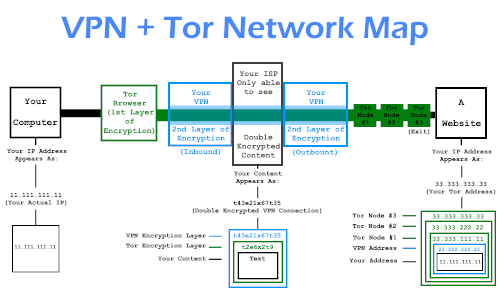
</p>


##### Surf:
+ ¹For more info please see: https://www.hackeroyale.com/how-to-stay-anonymous/
+ ²Comparison of ExpressVPN and NordVPN: https://www.tech21century.com/expressvpn-vs-nordvpn-comparison/
+ ³Hackers Exploit Weak Remote Desktop Protocol Credentials: https://www.bankinfosecurity.com/hackers-exploit-weak-remote-desktop-protocol-credentials-a-10433
+ ⁴Parrot Linux, better than Kali Linux: https://www.parrotsec.org/download-home.php
+ ⁵Very simple guide to WiFi hacking: https://mango.pdf.zone/hacking-your-neighbours-wifi


### <a id="list"></a>List of Automatic Hacking Tools

+ #### Recon Tools
  - AutoNSE : https://github.com/m4ll0k/AutoNSE - "Massive NSE (Nmap Scripting Engine) AutoSploit and AutoScanner." A helpful tool for those unfamiliar with the use of the powerful Nmap tool.
  - Reconnoitre : https://github.com/codingo/Reconnoitre - "A security tool for multithreaded information gathering and service enumeration."
  - WAES [(written by this author/Shiva] : https://github.com/Shiva108/WAES - "WAES (Web Auto Enum & Scanner) runs whatweb, nmap with http-enum and vulners.nse, nikto and uniscan against target while dumping results files."
  - Rapidscan : https://github.com/skavngr/rapidscan - "The Multi-Tool Web Vulnerability Scanner."
  - WPscan : https://github.com/wpscanteam/wpscan - "WordPress vulnerability scanner written for security professionals and blog maintainers to test the security of their sites."
+ #### Exploit Tools
  - Fuxpolider : https://github.com/almandin/fuxploider - "File upload vulnerability scanner and exploitation tool."
  - Galileo : https://github.com/m4ll0k/Galileo - "Galileo is an open source penetration testing tool for web applications."
  - AutoSploit : https://github.com/NullArray/AutoSploit - "AutoSploit attempts to automate the exploitation of remote hosts."
  - BadMod : https://github.com/MrSqar-Ye/BadMod - "BadMod detects websites cms & auto exploit."
  - XAttacker : https://github.com/Moham3dRiahi/XAttacker - "You can use this tool to check the security by finding the vulnerability in your website or you can use this tool to Get Shells "
+ #### Persistency Tools
  - WebShell : https://github.com/malwares/WebShell - A collection of web-Shells
  - Weevely : https://github.com/epinna/weevely3 - "Weevely is a web shell designed for post-exploitation purposes that can be extended over the network at runtime."
+ #### Multi Purpose Tools
  - FSOCIETY : https://github.com/Manisso/fsociety - "A Penetration Testing Framework, you will have every script that a hacker needs."
  - Fuck_Society : https://github.com/Skull00/Fuck_Society - "213 How To Find Hackable Websites
Hacking Tools / 18 Exploits".
+ #### Command & Control (C&C) Tools
  - TrevorC2 : https://github.com/trustedsec/trevorc2 - "TrevorC2 is a legitimate website (browsable) that tunnels client/server communications for covert command execution."
  - Merlin : https://github.com/Ne0nd0g/merlin  - "Merlin is a cross-platform post-exploitation HTTP/2 Command & Control server and agent written in golang."

### <a id="install"></a>Typical Installation of Tools
Please refer to the installation guide of each tool as installation procedures can differ tremendously. As goes for github tools a fast way to install is:
```
$ git clone https://github.com/<author>/<toolname>.git
$ cd <toolname>
```

<p align="center">
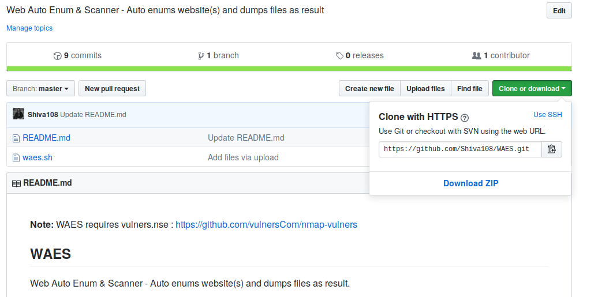
</p>


In the case of a python script there will frequently be a setup.sh or install.sh file included and often a requirement.txt file.
```
$ sudo ./setup.sh install
or
$ sudo ./install.sh
$ sudo pip install -r requirements.txt
```

### <a id="short"></a>Short Tool Info
At best refer to the guide / manual for each tool. The information below is giving a short overview of selected tools only.

#### Reconnoitre
"A reconnaissance tool made for OSCP labs to automate information gathering and service enumeration whilst creating a directory structure to store results, findings and exploits used for each host, recommended commands to execute and directory structures for storing loot and flags."

This tool is made for much more than auto web hacking but comes in handy for web hacking too, as Reconnoitre does auto enumeration against a server. Below is example of usage against hackthebox.eu (htb) retired machine "Granny" on IP 10.10.10.15 and files are dumped in /home/e/10.10.10.15/[folders]:

```
python ./reconnoitre.py  -t  10.10.10.15 --services -o /home/<output directory>/
```
<p align="center">
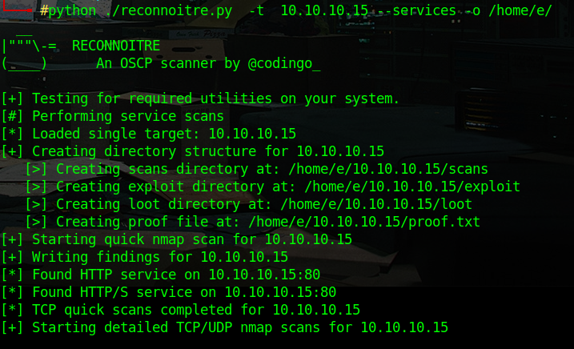
</p>


In the "10.10.10.15" folder Reconnoitre creates a directory structure as result:
+ exploit
+ loot
+ scans

While the first two "exploit" and "loot" are a setup for OSCP certification, "scans" holds dumps of a number files including "IP_findings.txt" which includes the cli commands used and findings for the IP. ]

#### Zeus Scanner
"Zeus is an advanced reconnaissance utility designed to make web application reconnaissance simple. Zeus comes complete with a powerful built-in URL parsing engine, multiple search engine compatibility, the ability to extract URLs from both ban and webcache URLs, the ability to run multiple vulnerability assessments on the target, and is able to bypass search engine captchas."

Zeus has, among other functions, a dork (more about dorks later) scanner. To do a basic dork scan type, in this case for sites vulnerable to SQLi (SQL-injection):

```
python zeus.py -d inurl:php?id=
```
The result will be similar to this:

<p align="center">
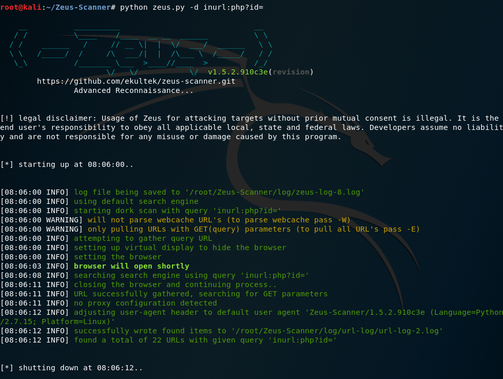
</p>

The output reveals the following:
> + **successfully wrote found items to '/root/Zeus-Scanner/log/url-log/url-log-2.log'**
> + **found a total of 22 URLs with given query 'inurl:php?id='**

Which means the output is stored in '/root/Zeus-Scanner/log/url-log/url-log-2.log' :

<p align="center">
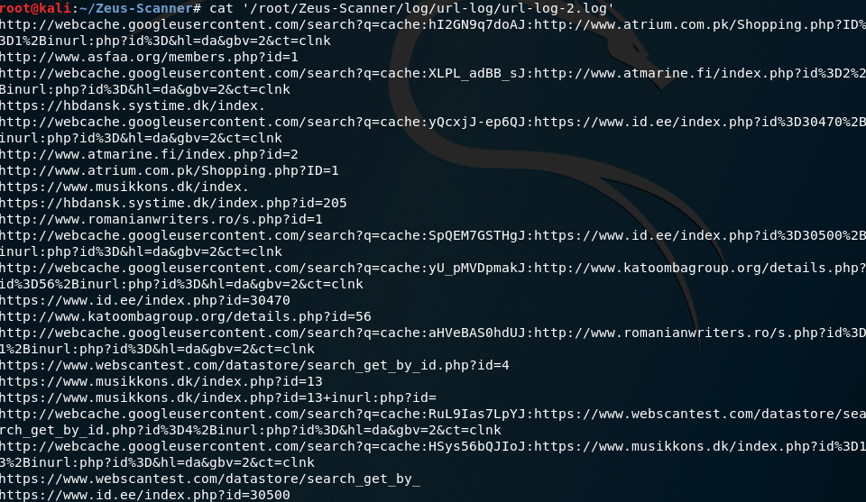
</p>

Now the Zeus list, of sites that are likely to be vulnerable to SQLi, can be passed on to SQLMAP (an auto SQLi exploitation script) or let Zeus handle it.

For more information please visit: https://latesthackingnews.com/2018/09/06/zeus-scanner-dork-searching-and-web-applications-vulnerability-assessment-tool/

```
python zeus.py –s –d <target website> --sqlmap-args=”threads 5, level=3, risk=3, randomAgent true”
```
This will use the SQLMAP API and with  SQLMAP output as result.

<p align="center">

</p>


### <a id="find"></a>How To Find Hackable Websites

There are multiple ways to find vulnerable/hackable websites. Two of these are covered in this guide:

+ By Chance
+ Using Dorks


#### By Chance

One of the ways to find hackable websites is to be observant while surfing and using browser addons for passive recon i.e. without scanning (see hacker killchain in "Introduction" section). Main browser extension for passive recon is Wappalyzer but others are useful as well:

+ Wappalyzer (WA): https://www.wappalyzer.com/download - "Wappalyzer is a cross-platform utility that uncovers the technologies used on websites."
+ Shodan Firefox Addon: https://github.com/PaulSec/Shodan-Firefox-Addon/ - Shows Shodan.io data directly in browser.
+ Netcraft Extension: https://toolbar.netcraft.com/ - Shows Netcraft.com data directly in browser, somewhat similar to Shodan addon but with a few cool extra features.

##### A View of a Vulnerable Site

This section shows what a hacker can see on a vulnerable site using the aforementioned addons.
First wappalyzer:

<p align="center">
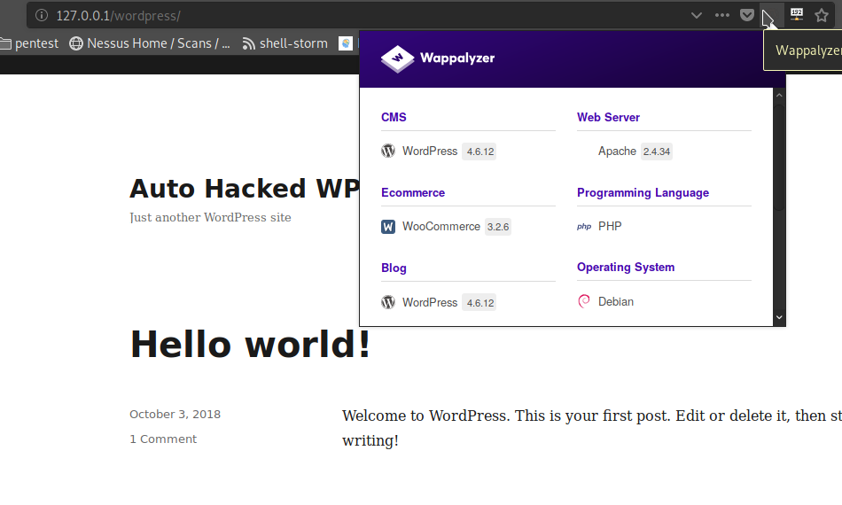
</p>

One gets a lot of interesting information just from this passive recon using WA:
+ CMS type and version: WordPress 4.6.12 - Old version, current is 4.9.8
+ Ecommerce type and version: WooCommerce 3.2.6 - a vulnerable version
+ Web Server type and version: Apache 2.4.34
+ Programming Language: PHP  - gives a hint for shell language
+ Operative System: Debian
+ and more...

Already from this information it can be deducted that the site is running an old version of WP and version of WC with know vulnerabilities. All this from just one plugin! This site is hacked in the "Scenarios: WordPress" section later.

Another example, this time Microsoft web-server:

<p align="center">
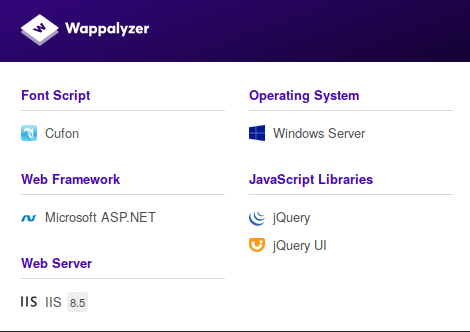
</p>

WA reveals that server is running IIS 8.5 and therefore a simple duckduckgo search on "Microsoft IIS 8.5 CVE" (Common Vulnerabilities and Exposures) reveals multiple vulnerabilities for this type of server. One such exploit is MS15-034¹ and allows Remote Code Execution (RCE), or "remote hack" against version 8.5 of IIS. Note that only unpached servers with IIS 8.5 are vulnerable to MS15-034. However this is a web hacking guide, as goes for server hacking look for upcoming articles [Ed./Shiva: Meaning after 10/2018].

The Shodan Firefox addon shows a somewhat different info about websites, meaning exclusively information about the server:

<p align="center">
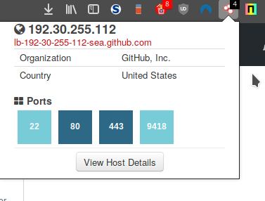
</p>


In this case the site is, the well known, github.com. The Shodan browser plugin reveals information such as:

+ IP address
+ C-name
+ Open Ports


This information is especially interesting if a site uses a Content Delivery Network (CDN)² or similar.


##### Surf:
+ ¹MS15-034: https://blog.sucuri.net/2015/04/website-firewall-critical-microsoft-iis-vulnerability-ms15-034.html
+ ²Forensic Investigation On CDN Hidden "Hebsites":  http://www.prosngurus.com/hack-website-behind-cloudflare-cdn/


#### By Using Dorks

Another, and common way, for hackers to find vulnerable sites is by using specific search terms in search engines, so called dorks¹ or by using scripts that search search engine API's or cache. This was demonstrated earlier in the "Zeus Scanner" chapter. There is a constant evolution in dorks and so the scriptkiddie should continuously keep updated by visiting sites with new dork lists. regularly to know the latest dorks. The main site for dorks is GHDB (Google Hacking Databse)²:

<p align="center">
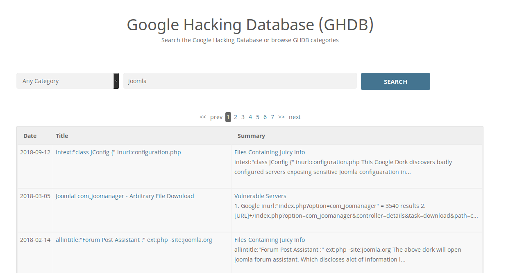
</p>

In the illustrated example joomla dorks from 2018 are found using GHDB.


##### Surf:
+ ¹Example dork list: http://www.conzu.de/en/google-dork-liste-2018-conzu/
+ ²Google Hacking Database: https://www.exploit-db.com/google-hacking-database/
+ other dork lists:
  - Dork list: https://gbhackers.com/latest-google-dorks-list/
  - Dork list: https://pr0zukti.blogspot.com/2018/01/Fresh-sql-i-dork-list-2018.html
  - Dork list:  https://hackertarget.com/google-dorking-wordpress/
  - Dork list: https://github.com/ironbits/SQLi-Dork-Repository


### <a id="scenarios"></a>Scenarios

#### Scenario 1: WordPress Site

More than 30% of sites on WWW are running WordPress CMS and so it's a needed skill for any web hacker to hack WP sites. It was common to find (very) old versions of WP installed everywhere but after "Automattic", the developer organisation behind WP, made automatic upgrading a default setting, this issue has been somewhat redeemed. However when developing a website, bureaus often disable automatic updating so the site wont break because of updating. As many customers do not pay for maintenance cost this leads to old versions of WP sites still running out there. This especially goes for sites running WooCommerce (WC) or other shopping addons with customizations, as it might be expensive and time-consuming to update.
Furthermore, many WP plugin developers are amateur enthusiasts with no idea about secure coding. This leads to many other attack vectors / exploit possibilites.

In the following section it is demonstrated how to automatically hack a vulnerable WP site with the "X Attacker" (XA) tool.

<p align="center">
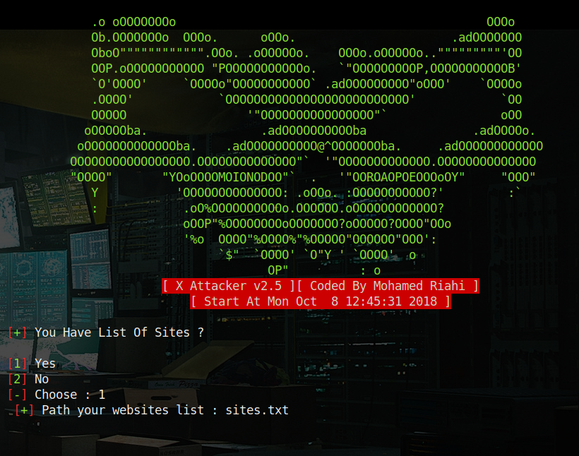
</p>

"X Attacker" got several modes, the easiest one is a list of sites from file, which in this case is "sites.txt" with the URL "http://127.0.0.1/wordpress/".

The tool is automatic and the next output is a list of exploits and whether they worked or not.

<p align="center">
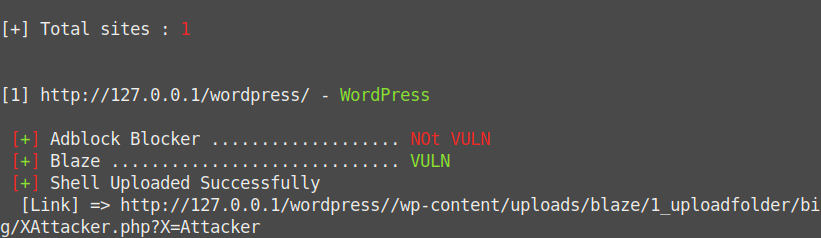
</p>

The site has the "Blaze" vulnerability and "X Attacker" auto hacked the site and gives link[?] for uploading of webshell. Visiting the link with the PHP file uploaded by XA looks like this in the browser:

<p align="center">
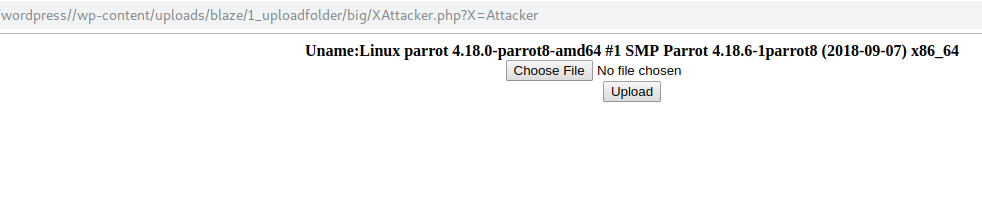
</p>

To upload a shell, "weevely" is utilized:

```
$ weevely generate verystrongpassword /<output>/<directory>/<shell file name>.php
```

The result will look similar to this screenshot:

<p align="center">
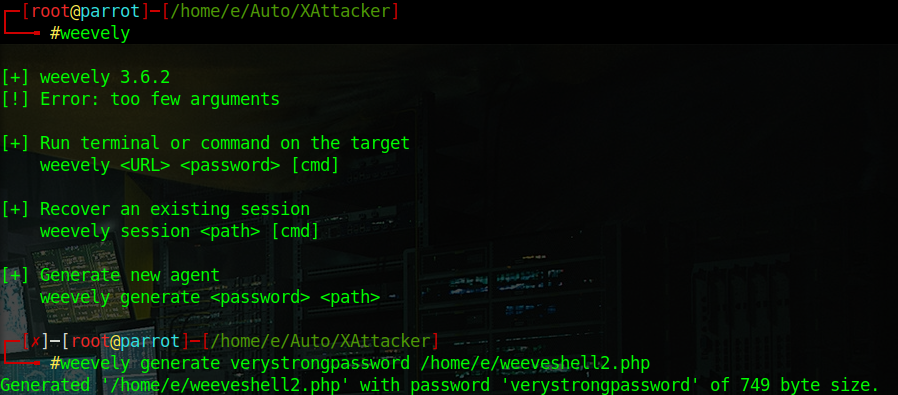
</p>

After uploading the shell XA even provides success messeage.

<p align="center">
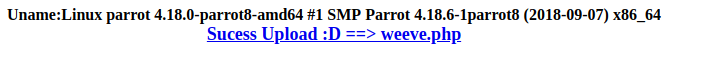
</p>

This means the site is hacked and the shell is ready, which means persistency. Just click the "Succes Upload" link to enjoy the backdoored WP site.


##### Surf
+ WordPress Vulnerability DB's:
  - https://wpvulndb.com/plugins?get=W
  - https://www.wordfence.com/blog/category/vulnerabilities/
  - https://www.jeffbullas.com/attacked-wordpress-plugins/
+ For WordPress Hacking Practice:
  - https://firstsiteguide.com/tools/free-fsg/hacked-dangerous-vulnerable-wordpress-plugins/
  - https://kinsta.com/knowledgebase/download-older-versions-of-wordpress-plugins/
